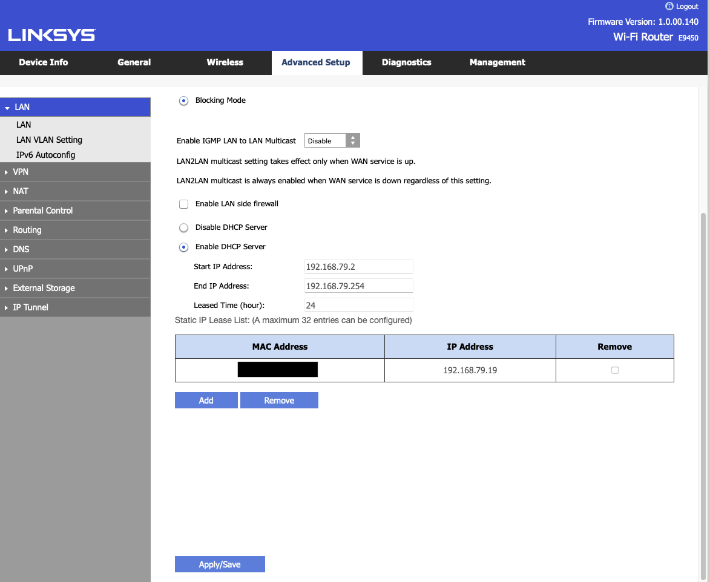
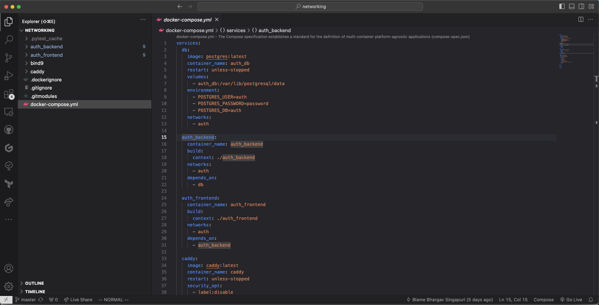
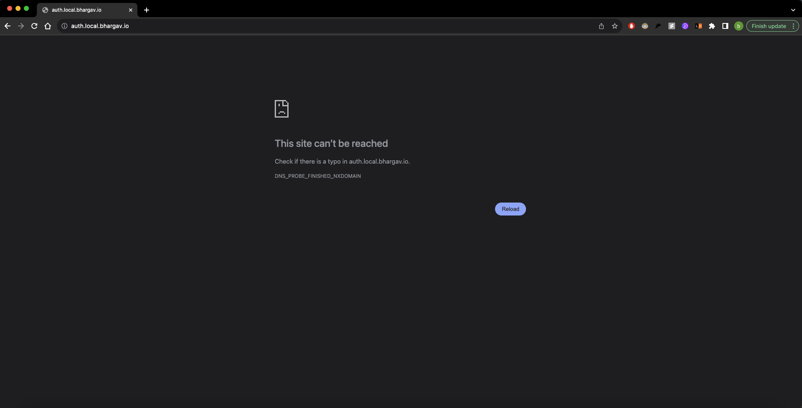
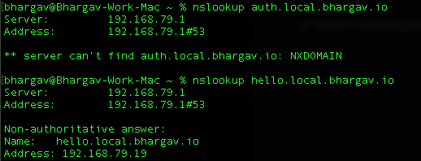

Success!
Well... Sort of.

<!-- truncate -->

## Intro

Over the weekend, I finally had some time to get started (and stuck) on the project.
Most of it was just getting the basics set up and running, things like git repos and router DNS/DHCP settings.
Since this is the first time I am doing such a project, my goal for the end of the weekend was to be able to serve a Next.Js page using my personal sub-domain name over my LAN.

I shall attempt to write these posts for someone that has zero idea of how such networking things work (me 3 weeks ago basically) and bring you along my thought processes and the steps that I took to get to where I am in the project currently.

I will assume basic knowledge in things like what is an IP address, domain name and how to navigate your router's settings.
I will also be linking resources that I have used to keep this as brief as possible.

## Router

### Why Start Here

The router is what contains the 2 key parts of the project that will eventually allow you to use a domain name to reach your server rather than using an IP address.

- DHCP (Dynamic Host Configuration Protocol) Server: this allows your router to dynamically assign local IP addresses to your devices.
  The router "leases" that address to you device for a set time (usually 24 hours) before it reassigns it.
  This ensures that there are always local IP addresses on your nework for new devices to join to.

- DNS (Domain Name System) Server: this service converts domain names - example.com - to IP addresses.
  This makes things easier for us since we can easily remember words not a series of numbers.
  Most routers will have a setting for you to define which DNS servers to use as default.

### Goal {#router-goal}

What we need to do is to give our server that hosts our applications (host server) a fixed IP address so that we do not have to keep reassigning new IP addresses to our domain name.
We also need to use a DNS server to to map our domain name to the host server's IP address.

### Steps {#router-steps}

Firstly, we need to "reserve" an IP address for our host server.
Luckily most routers come with a setting called DCHP Reservation that allows us to do just that.
Your router will list all the currently connected devices and their associated MAC and IP addresses as shown below.
Refer to your router's manual for how to reserve IP addresses.

|  |
| :------------------------------------: |
|          **DCHP Reservation**          |

Now that our computer has a fixed (static) IP address, it will forever be reachable at this address even if the computer disconnects and reconnects to the network at a later time.

Second, the DNS server.
We will get to setting up the server later on, but first we need to decide where the DNS server is running.
Some routers come with a DNS server built in, which makes this whole process a lot easier, while for most you have to set one up yourself.

For my router, a Linksys E9450, it does not come with a DNS server and by default takes whatever is set on the WAN (which in my case will be my Internet Service Provider's (ISP) DNS server.
It also has a setting for me to set primary and secondary DNS servers manually which is what I used for my setup.

I decided to run my DNS server on the same host server as my applications, just to make things simpler.
Thus, I set the static DNS addresses on the router as the following:

- Primary: 8.8.8.8 which is Google's DNS server

- Secondary: 192.168.79.19 which is my computer's local IP address.

The router will send any DNS queries that fail to be resolved to my DNS server.

Like what you are reading thus far? Consider becoming a subscriber and stay up to date on my tinkering.

## DNS Server

### Goal {#dns-goal}

Now that we have a static address for the DNS Server as well as the host server, we need to let the DNS server know where to find the host server.
For now they are both the same but that might not be the case in the future or for you.
We will have to insert an 'A' Record which maps a URL to an IPv4 address.
Similarly, there is also an 'AAAA' record that does the same with IPv6 addresses but we are keeping things simple here.

### Steps {#dns-steps}

I followed the tutorial by Christian Lempa which uses a Bind9 server running in Docker to handle the DNS functionality.
This might be a bit overkill for most of us but I think its a good stepping stone going forward.
As he also mentions in his follow-up video, he extends the setup to use Terraform to dynamically add new entries to the DNS server and manage the records that are currently present.

His tutorial is pretty easy and straightforward to follow, but if you want to see what I have done with my setup, you can refer to my networking repository.
I have left out the access control list portion for now but may reinstate it in the future depending on my needs.

## Webpage

### Goal {#webpage-goal}

Now that our client devices (any other device on the network) can find our host server using a URL, in my case with the \*.local.bhargav.io endpoints, we need to serve something from the host server for clients to see.
Since I will be making a Next.js application, I just wanted them to be able to see the default splash screen of the framework when it is first installed.

### Steps {#webpage-steps}

#### Caddy

Since I am running all my applications in Docker, I will need something that serves content from the correct container based on the URL that was used to reach the host server.
Accessing the containers based on their port numbers - e.g. `auth.local.bhargav.io:3000` is not a feasible solution since I will run into Cross-Origin-Resource-Sharing (CORS) issues later on.
Every site has to be served on port 80 for HTTP and 443 for HTTPS.

Thus we need a reverse proxy that matches the url to the correct docker container running the requested service.
Caddy is a server that does exactly that.
It is simple to use, lightweight and blazingly fast.
Since it will be running in the Docker environment as well, we need to map each incoming URL to the corresponding docker container.
For example:

`http://auth.local.bhargav.io` &rarr; `http://auth_frontend:3000`

`http://auth.local.bhargav.io/api/*` &rarr; `http://auth_backend:8000`

You can refer to the code in the networking repository for more details of the specifics of the implementation.
All the various services are orchestrated in the docker-compose.yml files.

#### Next.JS Server

At this point, our client can query the DNS for the IP of the host server, the request will then reach Caddy who will match the url to the correct docker container.
Now we just need the container for caddy to serve.

This is relatively straightforward if you have any experience with Dockerfiles and building and running your own custom containers.
Essentially what the Dockerfile will do is to spell out steps to create and start our frontend application as its own standalone container.

We are just going to start off with the default code that comes when setting up Next.js.
The Dockerfile is available on the auth frontend repository.
This container is then built and orchestrated on the same internal network as Caddy with Docker Compose.

|  |
| :----------------------------------------------: |
|              **docker-compose.yml**              |

## Results

Once the containers are built successfully, we can navigate to our auth url and we see the following:

|  |
| :-----------------------------------------: |
|               **Error Page**                |

Err...
Why is the page not being served?

When running nslookup on the DNS server for a random subdomian vs the auth subdomain, the following happens:

|  |
| :----------------------------------------------: |
|            **Cannot find auth page**             |

Cannot find IP for auth but can for hello

This is strange and not supposed to happen.
There was no record for hello and yet it was being served.
This is something that I still have to look into since I want to be able to finely control the urls that are accesible.

On the bright side at the very least I can indeed access the host server and display something using a URL.
I still have some troubleshooting to do and if you have any idea where I went wrong, please do let me know.
I will send many appreciations your way.

To end off the week's work, I also set up the backend server in Django, built its Docker container and deployed it in a similar fashion to the auth frontend.
The only difference being that now the frontend is the catchall for any url pathways that do not start with /api.

## Conclusion and Next Steps

This has been a great weekend thus far, and I wouldn't have thought that I will be able to achieve so much in such short time (literally a day??).
The first obvious next step is to figure out why the DNS server is not behaving as it should.
Is there some other service that is hindering my progress.
Going to be using this article to get some idea as to how to solve these issues.

Once that is resovled, I will look into setting up SSL for the site to ensure that there is a secure connection betweeen my applications and my devices.

Then I will look at running the services from a computer that is not the one that I am coding on.
I do have a spare Mac Mini that has been sitting around on my desk for the longest time and it would be great to put it to some use.
I had recently updated the hard drive from a disk drive to an SSD so that will help things like boot speed.
Since it is not supported beyond MacOS Catalina, I might just intall Ubuntu on it at the tradeoff of a nicer MacOS UI.
Decisions.

The next bit of infra that I need is to set up github actions that run locally on my host machine.
This will allow me to push code changes to the repository, run checks and once that is done, I can automatically deploy the changes to the Docker environment without me ever having to manually log into the system and make changes.

Once that is done, then I can finally move onto writing the applications proper.
Stick around to find out how that turns out.
Until next time!

Found this insightful? Share this with some friends to spread the knowledge!
