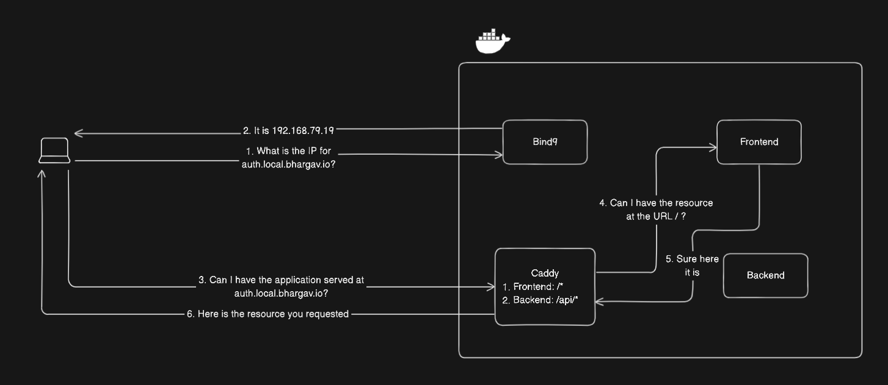
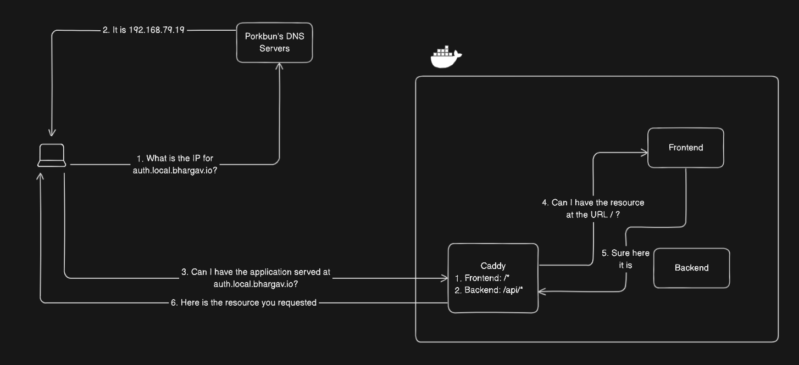
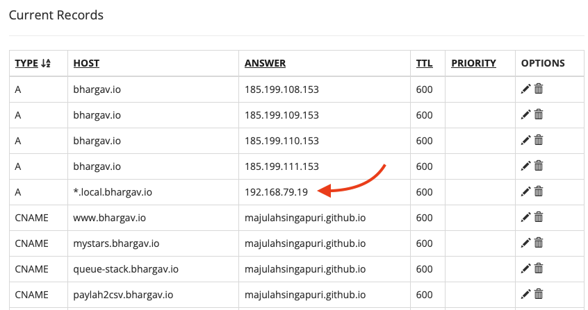
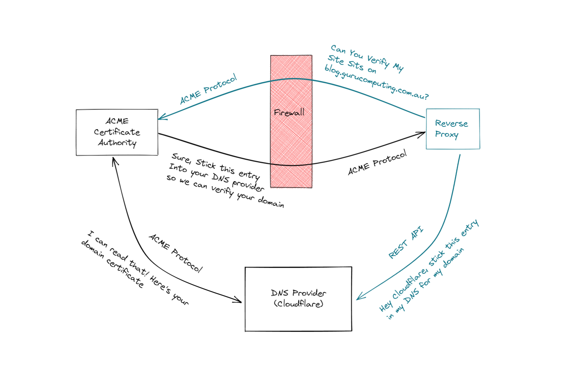
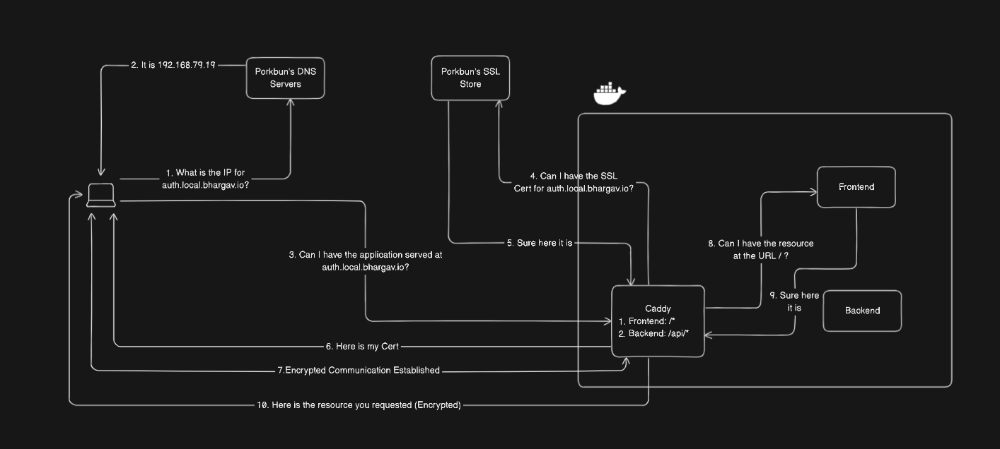
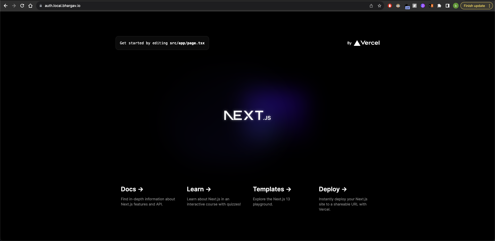
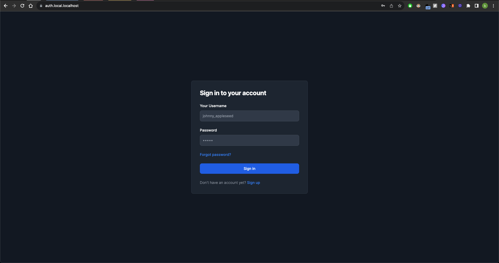
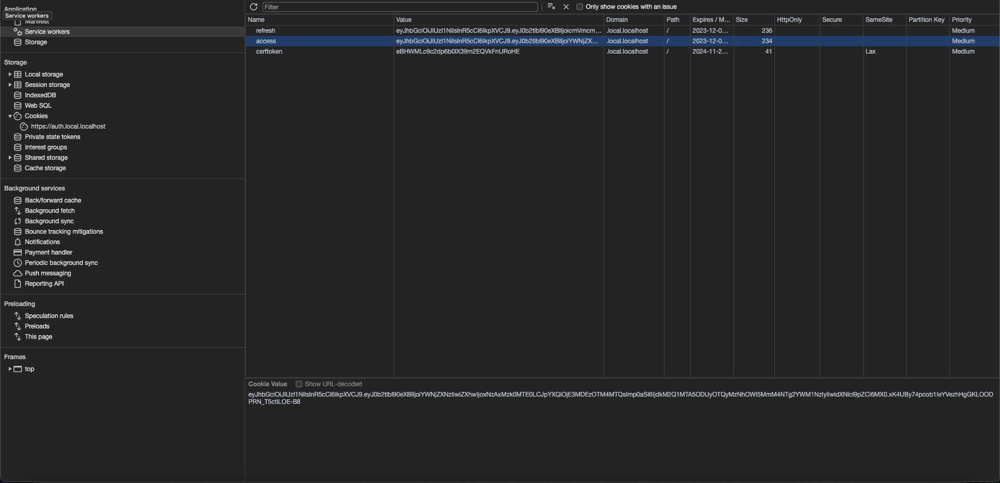
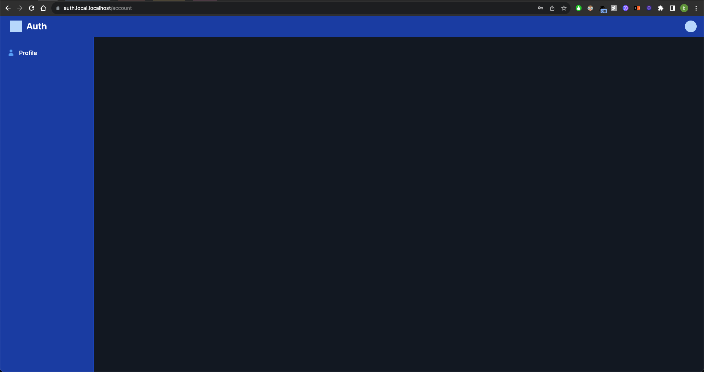

It's been a long while coming but there is progress...

<!-- truncate -->

First and foremost, apologies for the long delay in this post.
I have been inundated with Diwali celebrations and other work commitments.
This is still a side project for me and it will take some time to get done but thank you all for joining along on this journey.
Now let's run through some of the major changes that have happened in the project.

## URL Resolution

In the last update, I was using Bind9 as the nameserver to resolve local domain names to the server running my application and [Caddy](https://caddyserver.com/) to reverse proxy the applications in my Docker environment.
A flow of how that works is shown in the diagram below.

Unfortunately - if you remember from the last update - I was having issues resolving my domains with my Bind9 server.
In hindsight I think it was probably because it was not an authoritative nameserver, which I [later found out](https://kb.porkbun.com/article/63-how-to-switch-to-porkbuns-nameservers) I have to declare on the Porkbun site.

To keep things simpler, and not have to wrestle with more complexity in the system, I decided to use Porkbun's DNS records as per normal to resolve domain names and Caddy to reverse proxy the requests to the correct container.
This way, I can still update records on the fly as Caddy can be quickly hot-reloaded and it gives me the added benefit of SSL/TLS encryption as elaborated in the next section.

Thus my DNS resolution flow looks as such

Additionally, I had to add a wildcard DNS record using the Porkbun website to resolve all `*.local.bhargav.io` domains to `192.168.79.19`, where Caddy will then take care of the reverse proxying.

## Secure Socket Layer

Ever wonder why there is a lock icon next to any URL that you type in your browser? It shows that your connection to the server is secure and the data that is being transmitted and received is encrypted.
It also gives your browser the assurance that the server is who it says it is.

For more information you can read up on [this Cloudflare article](https://www.cloudflare.com/en-gb/learning/ssl/what-is-ssl/) for a primer but the important thing to note is that the server has a certificate signed by a trusted authority (CA) that has a public key which the client uses to encrypt data and a private key that the server uses to decrypt data.

In our case, my domain registrar has [API endpoints](https://porkbun.com/api/json/v3/documentation#SSL%20Retrieve%20Bundle%20by%20Domain) that allow for a reverse proxy or some similar software to get these certificates rather than storing the certificates and having to renew them every year and manually upload them to the server in question.
I am using Caddy as my reverse proxy and it provides this [handy bit of code](https://github.com/caddy-dns/porkbun) to encrypt all my communications on my local network.

Now the flow of loading the login page of my authentication server looks like the following.

It is definitely more complex than before but now with the added benefit of being a secure connection.
Finally, we have an authenticated login page.

## Authentication

Let's say that now we have built up the authentication page that allows the user to sign in on our auth subdomain, how do we ensure that this authentication stays intact on another subdomain such as `app.local.bhargav.io`? How do we also prove that the user is who they say they are?

Since we have already established a secure connection with the server, we can in fact send credentials to the client so that the client can then use them in every subsequent request to the server and be considered authorised.

### Credentials

There are 2 main kinds of authentication credentials that are commonly used.
The first is Cookies and the second is Tokens.
Generally these credentials are passed as a Header parameter in the Request but can also be passed in the body of the request if the server requests it as such.

#### Cookies

When authenticating with cookies, we generally use session cookies to determine the user and how long they can stay authenticated before they need to reauthenticate.
They are a great elementary way to ensure authentication but for the purposes of our app, where the user's session needs to be synced across multiple servers and subdomains, it adds complexity to the application.

#### Tokens

Tokens are a better way to enact a one-time authentication with a auth server and reuse that token across multiple other servers.
The auth server can provide a hexadecimal string that can be used to verify the user and it can also be refreshed at fixed expiry intervals to ensure that the user's data is not compromised if the token is.

However, there is still an issue of syncing across multiple servers as the app server will need to check with the Authentication server if the Token is valid before allowing the user to proceed.
This also adds extra complexity for a multi-domain application and we need a solution that extends upon the token concept and removes the need for the Authorisation server to keep checking the Authentication of the user.

#### JWTs

JSON Web Tokens are a kind of token that is customisable to the developer's needs and contains extra information about the user and thier permissions.
It can also be encrypted and signed so that the server knows that the token has not been tampered with to gain unauthorised access.

This is perfect for our use as the Authentication server can sign a JWT and return it to the user upon successful log in.
The user can then use the token in every subsequent request to the app server to prove it has the authorisation to access data.
The validity of the Token can even be checked by Caddy to ensure that unauthorised requests are being redirected to the Authentication server.
The app server can also see what are the permissions that the user has to conditionally render UI elements for the user and check API calls to ensure that the user has the right permissions to call the API.

### Storing Credentials

Typically Credentials are stored as Javascript variables using libraries such as `axios`.
However, we need to ensure that the tokens survive a page navigation to the app site once the user has been authenticated.
Hence we will use a mixture of tokens and cookies to ensure that the user stays authenticated until the token expires and will be forced to renew the token.

Cookies have a domain field that determines what domains can access this cookie.
By setting it to a value such as `.local.bhargav.io`, we can ensure that the cookie is valid for all local subdomains that the user can access.
For full details on the cookie implementation, do check out the repository.

## Local Testing

Now that we have the JWTs set up, how do we test it locally without having to repeatedly build the Docker containers.
The answer is to use a cheeky `localhost` subdomain that matches our actual domain structure.
Typically, domains have a Top-Level Domain, such as `.com` or in my case, `.io`.
localhost is also considered a TLD since there is nothing that comes after it.

Thus to emulate how my application will run in "production", we can use a subdomain like `auth.local.localhost`.
This behaves in the same way my actual domain will behave and the best part is that there is no need to set up DNS servers and A records.
Your machine will automatically resolve localhost domains to itself and all you need is reverse proxy to listen for this domain and reroute requests to the right servers running on your own machine.

This will also ensure that the cookies work as intended and we can also self-sign the TLS certificates to test how the app behaves using SSL.
Your browser might complain a bit but that's fine.
We can also see that credentials are being stored when the user successfully authenticates and logs in.

## Next Steps

So there we have it folks, a working authentication page that on successful sign in will redirect us to an app page where we can still access the JWTs to use for further requests.

As stated last time, next steps involve creating GitHub actions that will automatically package and deploy my applications to the right servers.
I had an issue with my Mac Mini not being able to turn on SSH and thus it was time to say goodbye to an old friend.
Perhaps in the future I will have a seperate and better computer that is capable of hadling the tasks that I need it to and we will be off to the races.

If you found this post interesting, do share it with friends!
