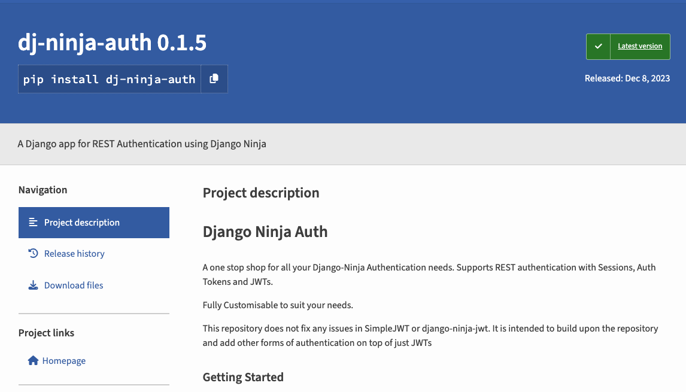

Creating the perfect (imo at least) REST authentication system for Django Ninja

<!-- truncate -->

Hello one and all and welcome back to another update!
I hope you are all having a wonderful holiday season.

## Why Start a New Project

In the process of creating my auth server, I have decided to do a little side quest and expand upon an [exisiting library](https://eadwincode.github.io/django-ninja-jwt/) for authentication in Django Ninja REST framework called `django-ninja-jwt`.
Why would I do such a thing?
Isn't there already too much on my plate that I have to go and add on a new project?

Firstly, yes.
I do have too many projects on my plate, considering that an auth server is just the first step in the process.
I still have to create the whole personal finance app, or whatever I end up creating in the end.
But at the same time, I personally have been pretty frustrated with the lack of REST authentication options for Django Ninja.
Yes, the base library provides a decent start for Session, Cookie and token authentication, it is not as robust as Django REST Framework.

## Why Django-Ninja-JWT

The library that I ended up forking does provide great support for JWT authentication but does not support any other kinds of cookie authentication.
But what it did have is a great system for customisations to the controllers and schemas as well as a working JWT authentication system that is symmetric to [Django REST Auth](https://github.com/iMerica/dj-rest-auth).
Hence, all I had to do was to port over the Token Authentication capability from DRA and add in the basic session authentication functionality and we are golden.

While I did remove some of the functionality from the JWT part of the project, namely the token blacklisting and routers for simplicity's sake, it is not difficult to re-incorporate it back into the project.
The key thing was to ensure that it had compatibility with Pydantic's v2 API while maintianing the same functionality.

What I also liked from the DRA and Ninja JWT libraries is that there sub-apps that extend the base app's functionality.
For DRA it is the `authtoken` app and for Ninja JWT it is the `blacklist` app.
This means that all I have to do is to keep the core authentication logic in the main app and add any other logic like checking of tokens and creating refresh endpoints in sub-apps.
This ensures that there is a top-down hierarchy and developers only use what they need.

What I ended up with is the [following](https://pypi.org/project/dj-ninja-auth/) library.

## Next Steps

Using an email and password for authentication is so old school.
Where is the good stuff? We need social authentication and since security is also important, we need to add in MFA.
Luckily, [Allauth](https://github.com/pennersr/django-allauth/tree/main) already provides these functionalities, albeit for apps that are fully managed by Django rather than being on the REST architecture.
This means that there will have to be some tweaking and bodging that has to be done in order to allow this to work properly.

## Goal

At the end of the day, my goal for this project is for it to be a fully fledged authentication system that provides support for all kinds of authentication, be it username/password or social and with MFA support built on JWTs or rotating Auth tokens.

## What You can Do

Every open source project needs time and manpower to keep up to date.
This repository is already 2 departed from the original SimpleJWT library and me being the only contributor will take considerable effort on my end.
If you find this library useful, want to get started with open source or think there are ways that I can improve the code (workflows, actions, tests) then do feel free to create PRs and help expand this project.

Thank you for your time and I hope you learnt something!
